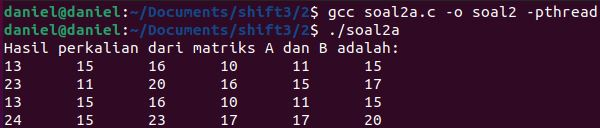
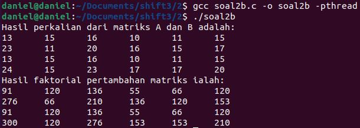
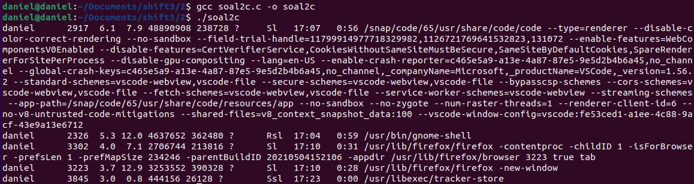

# soal-shift-sisop-modul-3-IT09-2021

Nama Anggota | NRP
------------------- | --------------		
Daniel Evan | 05311940000016
Natasya Abygail N | 05111940000020
Muhammad Naufal Imantyasto | 05111940000041

## List of Contents :
- [No 1](#Cara-Pengerjaan)
	- [1a](#1A)
	- [1b](#1B)
	- [1c](#1C)
	- [1d](#1D)
	- [1e](#1E)
	- [1f](#1F)
	- [1g](#1G)
	- [1h](#1H)
- [No 2](#Cara-Pengerjaan)
	- [2a](#2A)
	- [2b](#2B)
	- [2c](#2C)
- [No 3](#Cara-Pengerjaan)
	- [3a](#3A)
	- [3b](#3B)
	- [3c](#3C)
	- [3d](#3D)
	- [3e](#3E)

## Nomor 1
### Soal
(a).Pada saat client tersambung dengan server, terdapat dua pilihan pertama, yaitu register dan login. Jika memilih register, client akan diminta input id dan passwordnya untuk dikirimkan ke server. User juga dapat melakukan login. Login berhasil jika id dan password yang dikirim dari aplikasi client sesuai dengan list akun yang ada didalam aplikasi server. Lokasi penyimpanan berada dalam akun.txt. <br>
(b).Sistem memiliki sebuah database yang bernama files.tsv. Isi dari files.tsv ini adalah path file saat berada di server, publisher, dan tahun publikasi. Setiap penambahan dan penghapusan file pada folder file yang bernama  FILES pada server akan memengaruhi isi dari files.tsv. <br>
(c).Command "add" untuk mengupload file ke server <br>
(d).Command "download" untuk mendownload file dari server <br>
(e).Command "delete" untuk menghapus file yang berada di server <br>
(f).Command "see" untuk melihat isi file.tsv <br>
(g).Command "find" untuk menemukan file yang memiliki nama tertentu <br>
(h).running.log untuk mencatat penambahan atau pengurangan file <br>
### Cara Pengerjaan
#### Library
Berikut adalah library yang kami gunakan, baik pada server maupun pada client
``` C
#include <stdio.h>
#include <sys/socket.h>
#include <stdlib.h>
#include <netinet/in.h>
#include <string.h>
#include <unistd.h>
#include <arpa/inet.h>
#include <dirent.h>
```
#### 1A
##### Client
``` C
printf("Pilih menu :\n1.Register\n2.Login\n");
    scanf("%d",&pil);
    if (pil==1){
        send(sock , regist , strlen(regist) , 0 );
    }
    else if (pil==2){
        send(sock , login , strlen(login) , 0 );
    }
    valread = read( sock , buffer, 1024);
    if (strcmp(buffer,"sukses")==0){
        memset(buffer,0,sizeof(buffer));
        printf("Masukkan id : ");
        scanf("%d",&id);
        printf("Masukkan password : ");
        scanf("%s",pass);
        sprintf(idc,"%d",id);
        strcat(kirim,idc);
        strcat(kirim,":");
        strcat(kirim,pass);
        //printf("%s",kirim);
        send(sock , kirim , strlen(kirim) , 0 );
        valread = read( sock , buffer, 1024);
```
Pada Client akan ditampilkan isian sebagai berikut :
```
Pilih menu :
1.Register
2.Login
```
Jika client memilih register mode register akan dikirimkan ke server, jika client memilih login mode login akan dikirimkan ke server. Setelah server berhasil men-set modenya ke mode login atau register, selanjutnya client akan diminta memasukkan id dan password :
```
Masukkan id :
Masukkan password :
```
Setelah itu dengan fungsi ini
```C
sprintf(idc,"%d",id);
strcat(kirim,idc);
strcat(kirim,":");
strcat(kirim,pass);
```
id dan password dibentuk dalam format ```id:password``` selanjutnya format inilah yang dikirimkan kepada server.
##### Server
jika login
```C
if (strcmp(buffer,"2")==0){
	send(new_socket , sukses , strlen(sukses) , 0 );
memset(buffer,0,sizeof(buffer));
char * buff = 0;
long length;
FILE * f = fopen ("akun.txt", "rb");
```
Server akan mengirimkan status sukses masuk ke mode login ke client dan membuka file akun.txt, selanjutnya client akan meminta id dan password dari client.
```C
valread = read(new_socket , buffer, 1024);
strcat(isi,buffer);
ret = strstr(buff, isi);
if (ret){
	send(new_socket , login , strlen(login) , 0 );
memset(buffer,0,sizeof(buffer));
```
Untuk memeriksa id dan password digunakan fungsi strstr, jika ada maka login berhasil

#### 1B
##### Server
Membuka dan membuat file tsv
```C
FILE * tsv;
/* open the file for writing*/
tsv = fopen ("files.tsv","a+");
```
kami menggunakan fopen untuk membuat dan membuka ```files.tsv```, disini juga kami menggunakan mode ```a+``` yang berfungsi untuk append sehingga data akan terus di tulis tanpa di overwrite.
```C
strcat(tulis,"Publisher: ");
strcat(tulis,publish);
strcat(tulis,"\n");
strcat(tulis,"Tahun Publikasi: ");
strcat(tulis,tahun);
strcat(tulis,"\n");
strcat(tulis,"Filepath: ");
strcat(tulis,"FILES/");
strcat(tulis,namafile);
strcat(tulis,"\r\n\n");
if(tsv){
	fputs(tulis,tsv);
}
```
Apabila ada perintah add maka program akan melakukan cat terhadap inputan hingga berbentuk seperti ini :
```
Publisher:
Tahun Publikasi:
Filepath:
```
dan memasukkannya ke dalam files.tsv
#### 1C
##### Client
Ketika client mengirim command add maka program client akan meminta user untuk memasukkan publisher, tahun publikasi, dan filepath, selanjutnya informasi-informasi tersebut akan dikirimkan ke server, namun apabila file tidak ada maka akan ditampilkan pesan error. Berikut adalah kode yang kami gunakan.
```C
if(strcmp(cmd,"add")==0){
	send(sock , add , strlen(add) , 0 );
	printf("Publisher: ");
	scanf ("%s",publisher);
	send(sock , publisher , strlen(publisher) , 0 );
	printf("Tahun Publikasi: ");
	scanf ("%s",tahun);
	send(sock , tahun , strlen(tahun) , 0 );
	printf("Filepath: ");
	scanf ("%s",filename);
	send(sock , filename , strlen(filename) , 0 );
	fp = fopen(filename, "r");
	if(fp == NULL)
	{
		perror("[-]Error in reading file.");
		exit(1);
	}
	send_file(fp,sock);
	sleep(10);
}
```
Apabila file ada maka akan masuk ke fungsi send_file(). Jika saat pengiriman terjadi error maka akan ada pesan error, sedangkan jika tidak maka file sudah berhasil dikirimkan ke server.
```C
void send_file(FILE *fp, int sockfd)
{
    char data[SIZE] = {0};

    while(fgets(data, SIZE, fp)!=NULL)
    {
        if(send(sockfd, data, sizeof(data), 0)== -1)
        {
            perror("[-] Error in sending data");
            exit(1);
        }
        bzero(data, SIZE);
    }
}
```
##### Server
Ketika menerima command add dari client maka server akan melakukan strcat kepada semua inputan hingga membentuk format sebagai berikut : <br>
```
Publisher:
Tahun Publikasi:
Filepath:
```
Selanjutnya file inilah yang akan dimasukkan ke dalam file ```files.tsv```. Setelah itu server akan menerima data dari fungsi send_file() yang ada client dan mengolahnya dengan fungsi write_file(). Kemudian server akan melakukan strcat lainnya hingga membentuk format sebagai berikut : <br>
```
Tambah : File1.ektensi (id:pass)
```
Dimana hasil dari strcat ini akan dimasukkan kedalam ```running.log```.
```C
if (strcmp(buffer,"add")==0){
	valread = read(new_socket , buffer, 1024); //publisher
	memset(publish,0,sizeof(publish));
	strcpy(publish,buffer);
	valread = read(new_socket , buffer, 1024); //tahun
	memset(tahun,0,sizeof(tahun));
	strcpy(tahun,buffer);
	valread = read(new_socket , buffer, 1024); //nama file
	memset(namafile,0,sizeof(namafile));
	strcpy(namafile,buffer);

	strcat(tulis,"Publisher: ");
	strcat(tulis,publish);
	strcat(tulis,"\n");
	strcat(tulis,"Tahun Publikasi: ");
	strcat(tulis,tahun);
	strcat(tulis,"\n");
	strcat(tulis,"Filepath: ");
	strcat(tulis,"FILES/");
	strcat(tulis,namafile);
	strcat(tulis,"\r\n\n");
	//printf("%s",tulis);

	if(tsv){
	    fputs(tulis,tsv);
	}
	memset(tulis,0,sizeof(tulis));
	//printf("%s",namafile);
	addr_size = sizeof(new_addr);
	write_file(new_socket,namafile);
	memset(buffer,0,sizeof(buffer));


	//log
	strcat(t_log,"Tambah : ");
	strcat(t_log,namafile);
	strcat(t_log," (");
	strcat(t_log,isi);
	strcat(t_log,")\n");
	if(log){
	    fputs(t_log,log);
	}
}
```
Berikut adalah fungsi write_file() :
``` C
void write_file(int sockfd,char *file)
{
    int n; 
    FILE *fp;
    char filename[100]="FILES/";
    strcat(filename,file);
    char buffer[SIZE];

    fp = fopen(filename, "w");
    if(fp==NULL)
    {
        perror("[-]Error in creating file.");
        exit(1);
    }
    while(1)
    {
        n = recv(sockfd, buffer, SIZE, 0);
        if(n<=0)
        {
            break;
            return;
        }
        fprintf(fp, "%s", buffer);
        bzero(buffer, SIZE);
    }
    return;
    
}
```
Fungsi ini digunakan untuk menerima data dari client dan menyatukan tiap byte yang diterima menjadi susunan yang sesuai dengan file yang dikirimkan. Dalam fungsi ini juga, kami menambahkan ```FILES/``` pada filename agar file yang diterima langsung disimpan di folder FILES. Selain itu jika terdapat kegagalan dalam membuat file maka akan muncul pesan error. 
#### 1D
##### Client
Jika menerima perintah download maka program client akan meminta user memasukkan judul file yang akan di download, selanjutnya nama file ini dikirimkan ke server. jika file ada di server maka server akan mengirimkan file ke client dan client akan memprosesnya dengan fungsi ```write_file()```.
```C
else if(strcmp(cmd,"download")==0){
    send(sock , down , strlen(down) , 0 );
    printf("Masukkan judul: ");
    scanf("%s",download);
    send(sock , download , strlen(download) , 0 );
    addr_size = sizeof(new_addr);
    write_file(sock,download);
}
```
Fungsi write_file() ini berfungsi untuk mengolah byte atau data dari file yang telah dikirimkan oleh server, untuk disusun kembali menjadi file aslinya. Apabila pembuatan file gagal maka akan muncul pesan error.
``` C
void write_file(int sockfd,char *file)
{
    int n; 
    FILE *fp;
    char filename[100]="";
    strcat(filename,file);
    char buffer[SIZE];

    fp = fopen(filename, "w");
    if(fp==NULL)
    {
        perror("[-]Error in creating file.");
        exit(1);
    }
    while(1)
    {
        n = recv(sockfd, buffer, SIZE, 0);
        if(n<=0)
        {
            break;
            return;
        }
        fprintf(fp, "%s", buffer);
        bzero(buffer, SIZE);
    }
    return;
    
}
```
##### Server
Program server akan menerima nama file yang akan di di download, apabila tidak ada maka akan diberikan pesan error, sedangkan jika tidak maka program akan masuk ke fungsi send_file() untuk mengirim data.
```C
else if (strcmp(buffer,"down")==0){
	memset(buffer,0,sizeof(buffer));
	valread = read(new_socket , buffer, 1024); //file'
	strcpy(file_down,"FILES/");
	strcat(file_down,buffer);
	down = fopen(file_down, "r");
	if(down == NULL)
	{
	    perror("[-]Error in reading file.");
	    exit(1);
	}
	send_file(down,new_socket);
}
```
Fungsi send_file() ini berfungsi untuk mengirimkan file yang akan di download. Jika saat pengiriman terjadi error maka akan ada pesan error, sedangkan jika tidak maka file sudah berhasil dikirimkan ke server.
```C
void send_file(FILE *fp, int sockfd)
{
    char data[SIZE] = {0};

    while(fgets(data, SIZE, fp)!=NULL)
    {
        if(send(sockfd, data, sizeof(data), 0)== -1)
        {
            perror("[-] Error in sending data");
            exit(1);
        }
        bzero(data, SIZE);
    }
}
```
#### 1E
##### Client
Ketika client memasukkan command delete maka akan dikirimkan pesan kepada server untuk memasuki mode delete, dan client meminta nama file apa yang akan dihapus dan dikirimkan ke server.
```C
else if(strcmp(cmd,"delete")==0){
    send(sock , del , strlen(del) , 0 ); //pesan
    printf("Masukkan judul: ");
    scanf("%s",delete);
    send(sock , delete , strlen(delete) , 0 );
    memset(buffer,0,sizeof(buffer));
    valread = read( sock , buffer, 1024);
    if(buffer!=NULL){
	printf("%s",buffer);
    }
}
```
Jika file tidak ada maka pesan error dari server akan ditampilkan kepada client.
##### Server
```C
else if (strcmp(buffer,"delete")==0){
memset(buffer,0,sizeof(buffer));
valread = read(new_socket , buffer, 1024); //file
strcpy(file_del,buffer);
int flag;
char new_name[200]={0};
strcat(new_name,"old-");
strcat(new_name,file_del);
chdir("FILES");
flag = rename(file_del,new_name);
if(flag == 0) {
    strcat(t_log,"Hapus : ");
    strcat(t_log,namafile);
    strcat(t_log," (");
    strcat(t_log,isi);
    strcat(t_log,")\n");
    if(log){
	fputs(t_log,log);
    }
} else {
    send(new_socket , "file tidak ada\n" , strlen("file tidak ada\n") , 0 );
}
}
```
Ketika memasuki mode delete server akan melakukan rename ke file yang bersangkutan dengan format ```old-nama.ekstensi``` setelah itu menulis di file log, jika file tidak ada maka akan dikirimkan pesan error ```"file tidak ada"```.
#### 1F
##### Client
Ketika menerima command see maka client akan mengirimkan perintah see ke server, selanjutnya client akan menampilkan hasil yang diperoleh dari server.
```C
else if(strcmp(cmd,"see")==0){
    send(sock , see , strlen(see) , 0 );
    memset(buffer,0,sizeof(buffer));
    valread = read( sock , buffer, 1024);
    strcat(isi,buffer);
    printf("\n%s",isi);
}
```
##### Server
Sedangkan pada server, maka server akan membuka ```files.tsv``` dan menyimpan isinya pada sebuah variabel (buf) dan di copy ke variabel content yang selanjutnya akan dikirim ke client.
```
else if (strcmp(buffer,"see")==0){
	char * buf = 0;
	char content[1000]={0};
	long length;
	FILE * f = fopen ("files.tsv", "rb");

	if (f)
	{
		fseek (f, 0, SEEK_END);
		length = ftell (f);
		fseek (f, 0, SEEK_SET);
		buf = malloc (length);
		if (buf)
		{
		    fread (buf, 1, length, f);
		}
		fclose (f);
	}

	if (buf)
	{
	    strcpy(content,buf);
	    send(new_socket , content , strlen(content) , 0 );
	}
}
```
#### 1G
##### Client
Ketika client memasukkan command find maka program akan meminta memasukkan judul, yang selanjutnya dikirim ke server, dan di print kembali hasil yang didapat dari server.
```C
else if(strcmp(cmd,"find")==0){
    send(sock , find , strlen(find) , 0 );
    printf("Masukkan judul: ");
    scanf("%s",cari);
    send(sock , cari , strlen(cari) , 0 );
    //printf("%s\n%s",cmd,cari);
    memset(buffer,0,sizeof(buffer));
    valread = read( sock , buffer, 1024);
    strcat(isi,buffer);
    printf("\n%s",isi);
}
```
##### Server
```C
else if (strcmp(buffer,"find")==0){
memset(buffer,0,sizeof(buffer));
// printf(" %s",buffer);
valread = read(new_socket , buffer, 1024); //find nama
//printf(" %s",buffer);
strcat(cari,buffer);

int o=0, z=0;
DIR *d;
struct dirent *dir;
d = opendir("FILES");

//Determine the number of files
while((dir = readdir(d)) != NULL) {
    if ( !strcmp(dir->d_name, ".") || !strcmp(dir->d_name, "..") )
    {

    } else {
	o++;
    }
}
rewinddir(d);

char *filesList[o];

//Put file names into the array
while((dir = readdir(d)) != NULL) {
    if ( !strcmp(dir->d_name, ".") || !strcmp(dir->d_name, "..") )
    {}
    else {
	filesList[z] = (char*) malloc (strlen(dir->d_name)+1);
	//strncpy (filesList[z],dir->d_name, strlen(dir->d_name) );
	strcpy(filesList[z],dir->d_name);
	z++;
    }
}
rewinddir(d);

for(z=0; z<o; z++){
    if(strstr(filesList[z],cari)){
	//printf("%s\n", filesList[z]);
	if((strstr(filesList[z],"old-")==0)&&z>0){
	strcat(hasil_cari,filesList[z]);
	strcat(hasil_cari,"\n");}
    }
    send(new_socket , hasil_cari , strlen(hasil_cari) , 0 );
}
}
```
Server akan melakukan loop untuk menyimpan setiap nama yang ada dalam directory FILES, kemudian untuk mencocokkan nama file digunakan fungsi strstr, dan terdapat filter untuk file yang sudah dihapus (old-) dengan menggunakan strstr juga.
#### 1H
Ketika ada penambahan file maka program akan melakukan strcat dari data-data yang ada hingga memenuhi format ```Tambah : File1.ektensi (id:pass)```. Selanjutnya string inilah yang akan dimasukkan ke dalam file ```running.log```.
##### Penambahan File
```C
strcat(t_log,"Tambah : ");
strcat(t_log,namafile);
strcat(t_log," (");
strcat(t_log,isi);
strcat(t_log,")\n");
if(log){
	fputs(t_log,log);
}
```
##### Pengurangan File
Ketika ada pengurangan file maka program akan melakukan strcat dari data-data yang ada hingga memenuhi format ```Hapus : File2.ektensi (id:pass)```. Selanjutnya string inilah yang akan dimasukkan ke dalam file ```running.log```.
```C
trcat(t_log,"Hapus : ");
strcat(t_log,namafile);
strcat(t_log," (");
strcat(t_log,isi);
strcat(t_log,")\n");
if(log){
	fputs(t_log,log);
}
```
### Kendala
Kendala dalam pengerjaan program ini adalah files.tsv yang belum bisa menghapus data yang sudah dihapus, sehingga files.tsv hanya bisa memasukkan data.
## Nomor 2
### Soal
(a).Membuat program perkalian matrix (4x3 dengan 3x6) dan menampilkan hasilnya. Matriks nantinya akan berisi angka 1-20 (tidak perlu dibuat filter angka). <br>
(b).Membuat program dengan menggunakan matriks output dari program sebelumnya (program soal2a.c). Kemudian matriks tersebut akan dilakukan perhitungan dengan matrix baru (input user) sebagai berikut contoh perhitungan untuk matriks yang a da. Perhitungannya adalah setiap cel yang berasal dari matriks A menjadi angka untuk faktorial, lalu cel dari matriks B menjadi batas maksimal faktorialnya matri(dari paling besar ke paling kecil). <br>
(c).Program (soal2c.c) untuk mengecek 5 proses teratas apa saja yang memakan resource komputernya <br>
### Cara Pengerjaan
#### 2A
```C
#include <stdio.h>
#include <unistd.h>
#include <sys/shm.h>
#include <sys/stat.h>
#include <pthread.h>
#include <sys/ipc.h>

//deklarasi
int (*value)[10];
int hasil = 0;
int matriks_A[10][10], matriks_B[10][10], baris_A=4, kolom_A=3, baris_B=3, kolom_B=6; // deklarasi array
pthread_t thread1, thread2, thread3; // pembuatan thread

void *input_matriks_A(void *arg);
void *input_matriks_B(void *arg);

// fungsi menghitung perkalian matriks
void *perkalian_matriks(void *arg){
   for(int i=0;i<baris_A;i++){
      for(int j=0;j<kolom_B;j++){
         for(int k=0;k<kolom_A;k++){
            hasil+=matriks_A[i][k] * matriks_B[k][j]; //lakukan perhitungan perkalian matriks
         }
         value[i][j]= hasil; // menyimpanan hasil perkalian dalam var value
         hasil = 0; // nilai dikembalikan 0 agar bisa menghitung nilai ulang
      }
   }
   return NULL;
}

int main(){
   //template shared memory 
   key_t key = 1234;
   int shmid = shmget(key, sizeof(int[10][10]), IPC_CREAT | 0666); //int [10][10] membuat matriks (array multidimensi)
   value = shmat(shmid, 0, 0);

   pthread_create(&thread1, NULL, input_matriks_A, NULL); // membuat thread 1 matriks A
   pthread_join(thread1,NULL);

   pthread_create(&thread2, NULL, input_matriks_B, NULL); // membuat thread 2 matriks B
   pthread_join(thread2,NULL);

   for(int i=0;i<baris_A;i++){ // sebanyak 4 baris
      for(int j=0;j<kolom_B;j++){ // sebanyak 5 kolom
         value[i][j]=0;
      }
      pthread_create(&thread3, NULL, perkalian_matriks, NULL); // membuat thread 3 untuk hasil perkalian
      pthread_join(thread3,NULL);
   }

   //menampilkan hasil perkalian matriks
   printf("Hasil perkalian dari matriks A dan B adalah: \n");
   for(int i=0; i<baris_A; i++){ // sebanyak 4 baris
      for(int j=0;j<kolom_B;j++){  // sebanyak 5 kolom
         printf("%d\t", value[i][j]); // print per elemen diselat tab
      }
      printf("\n");
   }
}

//matriks pertama
void *input_matriks_A(void *arg) { //fungsi matriks pertama
   matriks_A[0][0]=2; //baris 1 kolom 1
   matriks_A[0][1]=1; //baris 1 kolom 2
   matriks_A[0][2]=3; //baris 1 kolom 3
   matriks_A[1][0]=4; //baris 2 kolom 1
   matriks_A[1][1]=3; //baris 2 kolom 2
   matriks_A[1][2]=1; //baris 2 kolom 3
   matriks_A[2][0]=2; //baris 3 kolom 1
   matriks_A[2][1]=1; //baris 3 kolom 2
   matriks_A[2][2]=3; //baris 3 kolom 3
   matriks_A[3][0]=4; //baris 4 kolom 1
   matriks_A[3][1]=3; //baris 4 kolom 2
   matriks_A[3][2]=2; //baris 4 kolom 2
   return NULL;
}

//matriks kedua
void *input_matriks_B(void *arg){ //fungsi matriks kedua
   matriks_B[0][0]=4; //baris 1 kolom 1
   matriks_B[0][1]=1; //baris 1 kolom 2
   matriks_B[0][2]=2; //baris 1 kolom 3
   matriks_B[0][3]=3; //baris 1 kolom 4
   matriks_B[0][4]=1; //baris 1 kolom 5
   matriks_B[0][5]=2; //baris 1 kolom 6
   matriks_B[1][0]=2; //baris 2 kolom 1
   matriks_B[1][1]=1; //baris 2 kolom 2
   matriks_B[1][2]=3; //baris 2 kolom 3
   matriks_B[1][3]=1; //baris 2 kolom 4
   matriks_B[1][4]=3; //baris 2 kolom 5
   matriks_B[1][5]=2; //baris 2 kolom 6
   matriks_B[2][0]=1; //baris 3 kolom 1
   matriks_B[2][1]=4; //baris 3 kolom 2
   matriks_B[2][2]=3; //baris 3 kolom 3
   matriks_B[2][3]=1; //baris 3 kolom 4
   matriks_B[2][4]=2; //baris 3 kolom 5
   matriks_B[2][5]=3; //baris 3 kolom 6
   return NULL;
}
```
Pada program soal2a.c ini kami membuat perkalian matriks dengan shared memory dan menampilkan hasilnya pada terminal.<br>

#### 2B
```C
#include <stdio.h>
#include <sys/ipc.h>
#include <sys/shm.h>
#include <unistd.h>
#include <pthread.h>

//deklarasi
unsigned long long angka; // memakai unsigned long long agar banyak menampung angka 
int baris = 4, kolom = 6; //baris 4 kolom 5

unsigned long long factorial(unsigned long long a);
void *faktorial(void *arg);

int main(){
    pthread_t thread;
    //shared memory template
    key_t key = 1234;
    int (*value)[10];
    int shmid = shmget(key, sizeof(int), IPC_CREAT | 0666);
    value = shmat(shmid, 0, 0);

    printf("Hasil perkalian dari matriks A dan B adalah: \n");
    //menampilkan hasil perkalian matriks pada soal 4a
    for(int i=0;i< 4;i++){
        for(int j=0;j<6;j++){
            printf("%d\t", value[i][j]);
        }
        printf("\n");
    }
    pthread_create(&thread, NULL, faktorial, NULL); // membuat thread faktorial 
    pthread_join(thread,NULL); // join thread faktorial
}

unsigned long long factorial(unsigned long long a){  //fungsi menghitung faktorial tambah
    if(a==0 || a==1) return 1;
    else return a+ factorial(a-1); //pemanggilan fungsi factorial
}

//fungsi faktorial
void *faktorial(void *arg){
    //shared memory template 
    key_t key = 1234;
    int (*value)[10];
    int shmid = shmget(key, sizeof(int), IPC_CREAT | 0666);
    value = shmat(shmid, 0, 0);
    
    printf("Hasil faktorial pertambahan matriks ialah: \n");
    
    for(int i=0;i<baris;i++){ // perulangan untuk baris
        for(int j=0;j<kolom;j++){ // perulangan untuk kolom
            angka=value[i][j]; // faktorial dihitung per elemen matriks hasil perkalian
            printf("%llu\t", factorial(angka)); // pemanggilan fungsi factorial untuk menghitung
        }
        printf("\n");
    }
    pthread_exit(0); // keluar thread
}
```
Selanjutnya pada soal2b.c ini kami membaca nilai yang sudah dihitung pada soal2a.c kemudian membuat membuat perhitungan matriks tersebut dengan matriks yang baru, dengan mengikuti aturan berikut ini :
```
If a >= b  -> a!/(a-b)!
If b > a -> a!
If 0 -> 0
```

<br/>
#### 2C
```C
#include<stdio.h>
#include<stdlib.h>
#include<sys/types.h>
#include<sys/stat.h>
#include<unistd.h>
#include<wait.h>
#include<fcntl.h>

void    loop_pipe(char ***cmd);

int main()
{
  char *ps[] = {"ps", "aux", NULL};
  char *sort[] = {"sort", "-nrk", "3,3", NULL};
  char *head[] = {"head", "-5", NULL};
  char **cmd[] = {ps, sort, head, NULL};

  loop_pipe(cmd);
  return (0);
}

void    loop_pipe(char ***cmd) 
{
  int   p[2];
  pid_t pid;
  int   fd_in = 0;

  while (*cmd != NULL)
    {
      pipe(p);
      if ((pid = fork()) == -1)
        {
          exit(EXIT_FAILURE);
        }
      else if (pid == 0)
        {
          dup2(fd_in, 0); //change the input according to the old one 
          if (*(cmd + 1) != NULL)
            dup2(p[1], 1);
          close(p[0]); //menutup input pipe
          execvp((*cmd)[0], *cmd);
          exit(EXIT_FAILURE);
        }
      else
        {
          wait(NULL);
          close(p[1]); //menutup output pipe
          fd_in = p[0]; //menyimpan input untuk loop selanjutnya
          cmd++;
        }
    }
}
```
Pada program soal2c.c ini kami menggunakan perintah ```ps aux | sort -nrk 3,3 | head -5``` untuk menampilkan 5 proses teratas yang memakan resource komputer.

<br/>
### Kendala
Secara keseluruhan tidak ada kendala pada soal ini.
## Nomor 3
### Soal
(a).Program menerima opsi -f seperti contoh di atas, jadi pengguna bisa menambahkan argumen file yang bisa dikategorikan sebanyak yang diinginkan oleh pengguna. <br>
(b).Program juga dapat menerima opsi -d untuk melakukan pengkategorian pada suatu directory. Namun pada opsi -d ini, user hanya bisa memasukkan input 1 directory saja, tidak seperti file yang bebas menginput file sebanyak mungkin. <br>
(c).Program menerima opsi * <br>
(d).Semua file harus berada di dalam folder, jika terdapat file yang tidak memiliki ekstensi, file disimpan dalam folder “Unknown”. Jika file hidden, masuk folder “Hidden”. <br>
(e).Setiap 1 file yang dikategorikan dioperasikan oleh 1 thread agar bisa berjalan secara paralel sehingga proses kategori bisa berjalan lebih cepat. <br>
### Cara Pengerjaan
#### 3A
```C
if(strcmp(argv[1], "-f") == 0)
{
// masuk ke mode -f

while (i < argc)
{
if(!is_regular_file(argv[i]))
{
	puts("EXIT not a file");
	exit(EXIT_FAILURE);
}

pthread_create(&(tid), NULL, cek_file, (void *)argv[i]);
pthread_join(tid, NULL);
i++;
}
}
```
Pada bagian ini jika program menerima input "-f" maka program akan melakukan looping pada file yang telah diinputkan dan diperiksa apakah file tersebut merupakan regular file atau tidak, jika tidak maka akan dikeluarkan error, dan program exit, namun jika tidak akan dibuat thread, dan memanggil fungsi cek_file.
#### 3B
```C
else if(strcmp(argv[1], "-d") == 0)
{
// masuk ke mode -d

if (argc > 3)
{
	puts("Mohon hanya memasukkan satu path directory!");
	exit(EXIT_FAILURE);
}

list_file(argv[2]);
read_path(argv[0]);

}
```
Pada bagian ini jika program menerima input "-d" maka program akan memeriksa terlebih dahulu apakah folder yang dimasukkan hanya 1 atau lebih, jika lebih maka akan di berikan peringatan, dan program exit. Sedangkan jika tidak maka akan masuk ke dalam fungsi ```list_file``` dan ```read_path```.
#### 3C
```C
else if(strcmp(argv[1], "*") == 0)
{
// masuk ke mode *

if (argc > 2)
{
	puts("Mohon tidak memasukkan argumen lain ketika menggunakan mode *");
	exit(EXIT_FAILURE);
}

printf("path = ");
puts(path);
list_file(path);

read_path(argv[0]);
}
```
Ketika client memasukkan perintah ```*``` maka program akan memeriksa apakah ada argumen lain yang dimasukkan atau tidak, jika tidak maka program akan melakukan print path dan masuk ke fungsi ```list_file``` dan ```read_path```.
#### 3D
```C
else
{ 
	cek_folder("Unknown");
	move_file2(path, "Unknown", nama_file, alamat_file);
}
```
Sedangkan untuk file yang tidak memiliki ekstensi akan dimasukkan dalam folder unknown
#### 3E
Berikut adalah program yang kami pakai untuk membuat thread.
```C
while(fgets(buffer, bufferLength, filePointer))
{
nama_file = strrchr(buffer, '/') + 1;

// Skip file txt dan file program
if (strcmp(nama_file, "list_file.txt\n") == 0 || strcmp(nama_file, temp) == 0)
{
printf("%s skipped\n", nama_file);
continue;
}
else{
buffer[strcspn(buffer, "\r\n")] = 0;  // buat hapus enter di buffer

pthread_create(&(tid), NULL, cek_file, (void *)buffer);

pthread_join(tid, NULL);
}
}
```
#### Fungsi
Berikut adalah fungsi-fungsi yang kami gunakan dalam progam ini
##### Fungsi is_regular_file()
```C
int is_regular_file(const char *path)
{
  struct stat path_stat;
  stat(path, &path_stat);
  return S_ISREG(path_stat.st_mode);
} 
```
Fungsi ini berfungsi untuk memeriksa apakah sebuah file merupakan file regular arau file unknown
##### Fungsi path_c()
```C
void path_c(char *str)
{
  FILE *fp;
  char buf[4096], *p;

  *str = '\0';
  if(!(fp = fopen("/proc/self/maps", "r"))) return;

  fgets(buf, sizeof(buf), fp);
  fclose(fp);

  *(p = strchr(buf, '\n')) = '\0';
  
  while(*p != ' ') p--;

  strcpy(str, p+1);
  str[PATH_MAX] = '\0';
}
```
Fungsi ini berfungsi untuk menuju path dari sebuah file
##### Fungsi list_file()
```C
void list_file(char *path)
{
  FILE *f = fopen("list_file.txt", "w");
  if (f == NULL)
  {
    puts("Error dalam membuka file");
    exit(1);
  }

  DIR *d;
  struct dirent *dir;

  d = opendir(path);
  if (d)
  {
    while ((dir = readdir(d)) != NULL)
    {
      if (dir->d_type == DT_REG)
      {
        fprintf(f, "%s%s\n", path, dir->d_name);
        index_file++;
      }
    }
    closedir(d);
    fclose(f);
  }
}
```
fungsi berfungsi untuk melakukan listing file-file apa saja yang ada dalam sebuah directory.
##### Fungsi read_path()
```C
void read_path(char *arg)
{
  FILE* filePointer;
  int bufferLength = 255;
  char buffer[bufferLength];

  // Variabel temp buat nyimpan argumen
  char *temp;
  temp = strrchr(arg, '/') + 1;
  strcat(temp, "\n");

  filePointer = fopen("list_file.txt", "r");

  // printf("JUMLAH FILES: %d\n", index_file);

  // Error handling mutex
  if (pthread_mutex_init(&lock, NULL) != 0)
  {
    puts("Gagal buat mutex");
    exit(EXIT_FAILURE);
  }

  // Buat thread
  while(fgets(buffer, bufferLength, filePointer))
  {
    nama_file = strrchr(buffer, '/') + 1;

    // Skip file txt dan file program
    if (strcmp(nama_file, "list_file.txt\n") == 0 || strcmp(nama_file, temp) == 0)
    {
      printf("%s skipped\n", nama_file);
      continue;
    }
    else{ 
      // WAKTU NYA MEMBUAT THREAD :)
      buffer[strcspn(buffer, "\r\n")] = 0;  // buat hapus enter di buffer

      pthread_create(&(tid), NULL, cek_file, (void *)buffer);

      pthread_join(tid, NULL);
    }
  }
  fclose(filePointer);

  // Hapus file "list_file.txt"
  if (remove("list_file.txt") == 0) puts("Direktori sukses disimpan!");
  else
    puts("Yah, gagal disimpan :(");
;
}
```
Fungsi ini ditujukan untuk membaca directory dan menyimpan file pada directory yang sesuai.
##### Fungsi cari_ekstensi()
```C
char *cari_ekstensi(char *filename)
{
  char *temp = filename;

  char *extension = strrchr(temp, '.');

  if(!extension || extension == temp) return 0;
  
  int len = 0;
  char tipe[100];

  extension = extension+1;
  strcpy(tipe, extension);

  if((extension[strlen(extension)-1] >= 'a' && extension[strlen(extension)-1] <= 'z') || (extension[strlen(extension)-1] >= 'A' && extension[strlen(extension)-1] <= 'Z'))
  {
    for(int i = 0; tipe[i]; i++)
    {
      tipe[i] = tolower(tipe[i]);
      len++;
    }
  }

  extension = tipe;

  return extension;
}
```
Fungsi ini berfungsi untuk melakukan checking ekstensi file.
##### Fungsi cek_folder()
```C
void* cek_folder(char *foldername)
{
  int len = 0;
  char tipe[100];

  strcpy(tipe, foldername);

  if(!strcmp(foldername, "Unknown"))
  {

  }
  else if((foldername[strlen(foldername)-1] >= 'a' && foldername[strlen(foldername)-1] <= 'z') || (foldername[strlen(foldername)-1] >= 'A' && foldername[strlen(foldername)-1] <= 'Z'))
  {
    for(int i = 0; tipe[i]; i++)
    {
      tipe[i] = tolower(tipe[i]);
      len++;
    }
  }

  foldername = tipe;
  int exist = 0;

  DIR *d;
  struct dirent *dir;
  d = opendir(".");

  while((dir = readdir(d)) != NULL) //smpe gada file lagi di dir
  {
    if(strcmp(dir->d_name,".") == 0 || strcmp(dir->d_name, "..") == 0) continue;

    //bukan file = dir
    if(!is_regular_file(dir->d_name))
    {
      if(!strcmp(foldername, dir->d_name))
      {
        exist = 1;
      }
    }
  }
  closedir(d);

  if (!exist)
  {
    mkdir(foldername, 0700);
  }
  else
  {
    // directory ada
  }
}
```
Fungsi ini berfungsi untuk melakukan checking file dalam sebuah directory dan memeriksa apakah sebuah directory sudah ada atau belum.
##### Fungsi move_file()
```C
void* move_file(char *pathc, char *ekstensi, char *nama_file, char *alamat_asal)
{
  sprintf(destpath, "%s%s/%s", pathc, ekstensi, nama_file);


  if (rename (alamat_asal, destpath))
  {
    // something went wrong
    if (errno == EXDEV) {
        // copy data and meta data 
    } else { printf("%s : Sad, gagal :(\n", nama_file); };
  } 
  else { printf("%s : Berhasil Dikategorikan\n\n", nama_file);// the rename succeeded
  }
}
```
Fungsi ini berfungsi untuk memindahkan file ke directory yang bersesuaian
##### Fungsi cek_file()
```C
void *cek_file(void *arg)
{
  // Lock mutex
  pthread_mutex_lock(&lock);

  nama_file = strrchr((char *)arg, '/') + 1;
  alamat_file = (char *)arg;

  if(cari_ekstensi(nama_file))
  { 
    cek_folder(cari_ekstensi(nama_file));
    move_file2(path, cari_ekstensi(nama_file), nama_file, alamat_file);
  }
  else
  { 
    cek_folder("Unknown");
    move_file2(path, "Unknown", nama_file, alamat_file);
  }

  // Unlock mutex
  pthread_mutex_unlock(&lock);
  return NULL;
}
```
Fungsi ini berfungsi untuk melakukan checking pada file mulai dari path, ekstensi, move file, dan jika tidak ada ekstensi akan dipindahkan ke directory unknown.
### Kendala
Secara keseluruhan tidak ada kendala pada soal ini.
